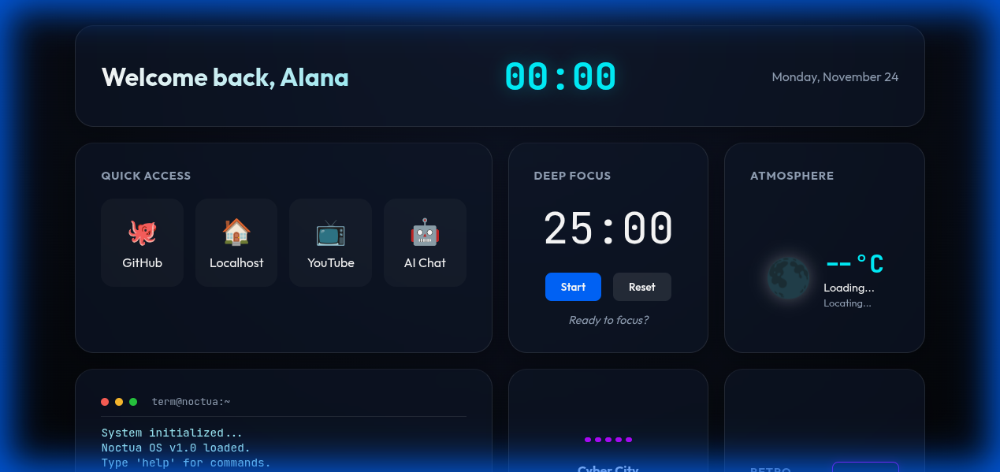

# 🌌 Noctua Command Center

<div align="center">


**A stunning celestial-themed productivity dashboard with interactive constellations**

[✨ Features](#-features) • [🚀 Quick Start](#-quick-start) • [📸 Screenshots](#-screenshots) • [🎮 Usage](#-usage)

</div>

---

## 🌟 Overview

**Noctua Command Center** is a beautiful, feature-rich personal dashboard that combines productivity tools with an immersive celestial aesthetic. Built with vanilla JavaScript and modern CSS, it features interactive constellation backgrounds, glassmorphism UI, and a suite of useful widgets.

Perfect for developers, creatives, and anyone who wants a stunning homepage that's both functional and beautiful.

## ✨ Features

### 🎨 **Visual Excellence**
- **Interactive Constellations** - Canvas-based star field that connects to your cursor
- **Glassmorphism UI** - Modern frosted glass panels with smooth animations
- **Celestial Color Palette** - Cyan, purple, and blue accents inspired by the night sky
- **Fully Responsive** - Adapts beautifully to any screen size

### ⚡ **Productivity Widgets**

#### 🕐 Clock & Greeting
- Real-time clock with dynamic greeting (Good Morning/Afternoon/Evening)
- Beautiful date display
- Gradient text effects

#### 🔗 Quick Access Links
- Customizable quick links to your favorite sites
- Hover effects and smooth transitions
- Default links: GitHub, Localhost, YouTube, AI Chat

#### ⏱️ Deep Focus (Pomodoro Timer)
- 25-minute focus sessions
- Start/Pause/Reset controls
- Visual countdown with status messages
- Perfect for productivity

#### 🌦️ Atmosphere (Weather Widget)
- Real-time weather using Open-Meteo API
- Geolocation support with fallback to São Paulo
- Temperature, conditions, and location display
- Animated weather icons

#### 💻 Mini Terminal
- Interactive command-line interface
- Built-in commands: `help`, `whoami`, `date`, `echo`, `clear`, `projects`, `snake`
- Retro terminal aesthetic
- Extensible command system

#### 🎵 Sonic Player
- Music player with visualizer
- Animated frequency bars
- Play/Pause/Next/Previous controls
- Progress bar
- Playlist support with free music

#### 🎮 Retro Corner
- Classic Snake game integration
- Modal overlay
- Quick access from terminal or button

## 🚀 Quick Start

### Installation

1. **Clone the repository**
   ```bash
   git clone https://github.com/NoctuaCoder/noctua-command-center.git
   cd noctua-command-center
   ```

2. **Open in browser**
   ```bash
   # Simply open index.html in your browser
   open index.html  # macOS
   xdg-open index.html  # Linux
   start index.html  # Windows
   ```

   Or use a local server:
   ```bash
   # Python 3
   python -m http.server 8000
   
   # Node.js (with npx)
   npx serve
   ```

3. **Visit** `http://localhost:8000` (if using a server) or just open the file directly!

### No Dependencies! 🎉
This project uses **zero external dependencies**. Just vanilla HTML, CSS, and JavaScript!

## 📸 Screenshots

### Main Dashboard


### Interactive Constellations
The background features a dynamic star field that creates connections to your cursor, creating beautiful constellation patterns as you move.

### Widgets in Action
- **Pomodoro Timer** helps you stay focused with 25-minute work sessions
- **Weather Widget** shows real-time conditions for your location
- **Terminal** provides quick command access
- **Music Player** keeps you in the zone with background music

## 🎮 Usage

### Customizing Quick Links

Edit the links in `index.html`:

```html
<a href="https://your-site.com" target="_blank" class="link-card">
    <span class="icon">🚀</span>
    <span>Your Site</span>
</a>
```

### Adding Terminal Commands

Edit `js/terminal.js`:

```javascript
const commands = {
    yourcommand: "Your response here",
    // or with function
    yourfunc: (args) => {
        return `You typed: ${args.join(' ')}`;
    }
};
```

### Customizing Colors

Edit `css/variables.css`:

```css
:root {
    --accent-cyan: #00f3ff;
    --accent-purple: #bd00ff;
    --accent-blue: #0066ff;
    /* Customize to your liking! */
}
```

### Adding Music to Player

Edit the playlist in `js/player.js`:

```javascript
const playlist = [
    {
        title: "Your Song",
        artist: "Artist Name",
        url: "path/to/your/song.mp3"
    }
];
```

## 🏗️ Project Structure

```
noctua-command-center/
├── index.html              # Main HTML file
├── css/
│   ├── variables.css       # CSS custom properties
│   ├── global.css          # Global styles & layout
│   └── components.css      # Component-specific styles
├── js/
│   ├── main.js            # Entry point & initialization
│   ├── constellations.js  # Interactive star background
│   ├── pomodoro.js        # Timer functionality
│   ├── weather.js         # Weather widget
│   ├── terminal.js        # Terminal commands
│   └── player.js          # Music player
└── README.md              # You are here!
```

## 🎨 Design Philosophy

- **Celestial Theme** - Inspired by the night sky and constellations
- **Glassmorphism** - Modern frosted glass aesthetic
- **Micro-interactions** - Smooth animations and hover effects
- **Responsive First** - Works beautifully on all devices
- **Performance** - Optimized canvas rendering and smooth 60fps animations

## 🛠️ Technologies

- **HTML5** - Semantic markup
- **CSS3** - Modern features (Grid, Flexbox, Custom Properties, Backdrop Filter)
- **JavaScript ES6+** - Modules, Classes, Arrow Functions
- **Canvas API** - For constellation rendering
- **Geolocation API** - For weather location
- **Audio API** - For music player

## 🌐 Browser Support

- ✅ Chrome/Edge (latest)
- ✅ Firefox (latest)
- ✅ Safari (latest)
- ✅ Opera (latest)

## 📝 License

MIT License - feel free to use this project for personal or commercial purposes!

## 👤 Author

**Alana (NoctuaCoder)**
- GitHub: [@NoctuaCoder](https://github.com/NoctuaCoder)

## 🙏 Credits

- **Fonts** - [Google Fonts](https://fonts.google.com/) (Outfit, JetBrains Mono)
- **Weather API** - [Open-Meteo](https://open-meteo.com/)
- **Music** - [Free Music Archive](https://freemusicarchive.org/)

## 🚀 Future Enhancements

- [ ] PWA support with offline functionality
- [ ] Customizable widget layout (drag & drop)
- [ ] More terminal commands and Easter eggs
- [ ] Theme switcher (light/dark/custom)
- [ ] Widget settings persistence (localStorage)
- [ ] Additional widgets (Notes, Tasks, Calendar)
- [ ] Spotify integration for music player
- [ ] Custom background options

## 💖 Support

If you like this project, please give it a ⭐ on GitHub!

---

<div align="center">

**Made with 💜 by NoctuaCoder**

*"Navigate the cosmos of productivity"* 🌌

</div>
